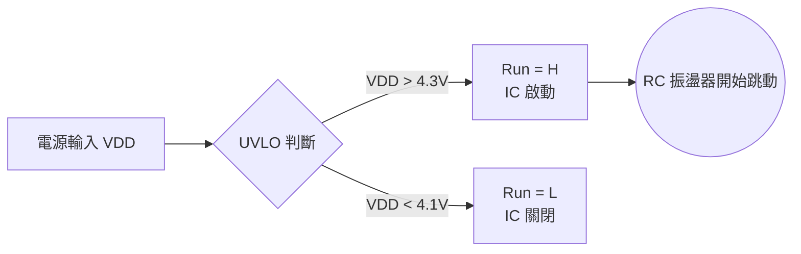

# [SIMPLIS 建模實戰 02] 喚醒 IC 的守門員：UVLO 與遲滯效應

在我們準備讓晶片的心臟（振盪器）跳動之前，必須先經過一位嚴格的守門員 —— **UVLO (Under-Voltage Lockout，欠壓鎖定)**。

想像一下，當電源剛接上，電壓從 0V 緩慢上升時，IC 內部的邏輯閘和運算放大器都處於「半醒半睡」的不穩定狀態。如果這時候就允許輸出 PWM 訊號去推動外部的功率開關，極有可能造成 MOSFET 擊穿炸毀。UVLO 的任務，就是確保電源電壓 ($V_{DD}$) 達到絕對安全的標準後，才發出「全局致能 (Global Enable)」的指令。

---

## 🛡️ 為什麼 UVLO 必須要有「遲滯 (Hysteresis)」？

很多初學者會以為，UVLO 只是一個簡單的比較器：「大於 4.3V 就開機，小於 4.3V 就關機」。

但在真實的電源環境中，輸入電壓是充滿雜訊 (Noise) 的。如果我們只設定單一門檻 (例如 4.3V)，當輸入電壓剛好在 4.3V 附近微幅震盪時，IC 就會在一秒內瘋狂地「開機、關機、開機、關機」，這稱為 **Chattering (震顫)** 現象，對電路是致命的。

為了解決這個問題，工程師引入了**遲滯 (Hysteresis)** 的概念。我們設定兩個不同的門檻：

- **啟動電壓 ($V_{ON}$)**：電壓必須上升超過此點，IC 才開機（例如 4.3V）。
- **關閉電壓 ($V_{OFF}$)**：電壓必須下降低於此點，IC 才關機（例如 4.1V）。

這中間 0.2V 的差距就是「遲滯區間」，它提供了強大的抗雜訊能力。

---

## 🎛️ 互動展示：遲滯效應的抗雜訊魔法

你可以透過下方的互動圖表，調整輸入電壓的「雜訊幅度」，並觀察有遲滯與無遲滯的 UVLO 輸出差異：

*(試著把「輸入雜訊幅度」拉大，你會發現最上方的「無遲滯」輸出會出現嚴重的碎裂（Chattering），而「有遲滯」的輸出依然穩如泰山！)*

  

    

      <label>開機門檻 (V_ON): 4.3 V</label>
      <input type="range" id="Von" min="3.0" max="6.0" step="0.1" value="4.3" oninput="updateUVLO()">
    

    

      <label>關機門檻 (V_OFF): 4.1 V</label>
      <input type="range" id="Voff" min="2.0" max="5.5" step="0.1" value="4.1" oninput="updateUVLO()">
    

    

      <label>輸入雜訊幅度: 0.5 V</label>
      <input type="range" id="Noise" min="0" max="1.5" step="0.1" value="0.5" oninput="updateUVLO()">
    

  

  <canvas id="uvloChart" width="400" height="200"></canvas>

---

## 🛠️ 在 SIMPLIS 中建立 UVLO 模型

在了解理論後，我們要在 SIMPLIS 裡實現這個功能其實非常簡單。但首先，我們可以從 TPS40200 datasheet 中看到 UVLO 的真實應用電路：

> [!tip] 訊號標示小提示
>    - 這裡的 `Run` 訊號為 Low-Active。為了後續能更直觀地辨識，我們統一將它標示為 **`Run#`**。
>    - TI 提供的電路圖有異常，bypass 電阻應該發生在 $545\text{k}\Omega$ 的位置。

很多工程師看懂了分壓，卻沒看懂「開關」是怎麼創造遲滯的。如果我們把旁路開關設計在下方，電壓反而會瞬間跌落造成「負遲滯」震盪。正確的硬體邏輯是**透過旁路上方電阻，讓分壓電壓瞬間跳高**。我們來推導一下這組精妙的數字（假設 $R_{top}$ 為 $509\text{k}\Omega$ 串聯 $36\text{k}\Omega$，$R_{bot}$ 為 $236\text{k}\Omega$）：

- **IC 尚未工作 (Run# = H)**：此時旁路開關斷開，上方電阻為總和 $545\text{k}\Omega$。
    當輸入電壓達到 4.3V 時，分壓點的電壓正好是：

    $$
    V_{tap} = 4.3\text{V} \times \frac{236\text{k}\Omega}{545\text{k}\Omega + 236\text{k}\Omega} \approx 1.3\text{V}
    $$

    比較器偵測到電壓達標，使 `Run# = L`，IC 正式啟動。

- **IC 正常工作 (Run# = L)**：啟動瞬間，內部開關閉合，把上方的 $36\text{k}\Omega$ 旁路掉，上方電阻只剩 $509\text{k}\Omega$！
    這會讓分壓點電壓瞬間**往上跳躍**，遠離 1.3V 的關機警戒線。若要讓 IC 關機，輸入電壓必須下降得更低：

    $$
    V_{OFF} = 1.3\text{V} \times \frac{509\text{k}\Omega + 236\text{k}\Omega}{236\text{k}\Omega} \approx 4.1\text{V}
    $$
    
這就是真實 IC 產生 0.2V 遲滯區間的硬體智慧！不過在建立 Behavior Model 時，SIMPLIS 內建了多種邏輯元件，我們不需要親自用開關和電阻去刻畫這個過程。我們可以直接使用內建的 **遲滯比較器 (Comparator with Hysteresis)**：

1. 開啟 SIMPLIS，放置一個 **Comparator with Hysteresis**。
2. 將正輸入端接至電源腳位 `VDD`，負輸入端接至一電壓源`V1`，並設定數值為`{V_UVLO_REF}`。
3. 按 `F11` 定義變數：

        .var V_UVLO_ON = 4.3
        .var V_UVLO_OFF = 4.1
        .var V_UVLO_HYS = {V_UVLO_ON - V_UVLO_OFF}
        .var V_UVLO_REF = {(V_UVLO_ON + V_UVLO_OFF) / 2}

4. 雙擊比較器，設定其參數：
	- **Hysteresis (遲滯寬度)**：設定為兩者的差值 `{V_UVLO_HYS}`。
5. 這個比較器的輸出，就是我們的 **`Run` (全局致能訊號)**。在後續的建模中，所有的模塊（包含振盪器、PWM 比較器）都必須收到這個訊號為 `High` 時，才允許動作。

打好這層安全地基後，我們下一篇終於可以安心地喚醒晶片，建立它的心臟——RC 振盪器了！

---

## 〽️模擬確認結果
由於現在只是 UVLO 的比較器，我們需要外給一個 `VDD` 訊號來測試比較器的輸出結果。 

在 SIMPLIS 中，使用 **Voltage Sources --> Waveform Generator** (快捷鍵為 `W`)，我們創造出一個 0 到 5V 的三角波訊號作為 `VDD` 的輸入，藉此觀察 UVLO 比較器的輸出是否依據我們想要的條件發生變化： 

- 當 $V_{DD}$ 上升超過 4.3V 時，`Run` 輸出切換為 **H**。  
- 當 $V_{DD}$ 下降低於 4.1V 時，`Run` 輸出切換為 **L**。

---

## 📥 實作檔案下載

如果你在繪製上有遇到困難，或者想直接看看最終的成果，可以下載我做好的完成檔：

- [👉 下載 Part 2 完成檔：UVLO 遲滯比較器模型 (tps40200_part2_uvlo.sxsch)](../assets/models/tps40200_part2_uvlo.sxsch)