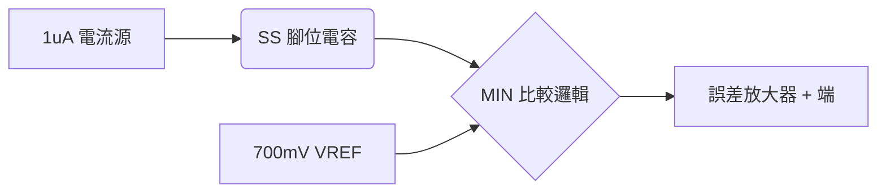

# [SIMPLIS 建模實戰 05] 守護系統的盔甲：Soft-Start 與 OCP 保護機制

如果說誤差放大器是 IC 的大腦，那麼 **Soft-Start (SS, 軟啟動)** 與 **OCP (Over-Current Protection, 過流保護)** 就是系統的盔甲與免疫系統。

在進行系統級模擬時，如果模型沒有這兩個機制，你將無法觀測到電源啟動時的突波電流（Inrush Current），也無法評估當負載發生短路時，IC 是否能進入 **Hiccup (打嗝模式)** 以保護功率元件不被燒毀。

---

## 🏃 軟啟動 (Soft-Start)：循序漸進的優雅

TPS40200 的軟啟動原理非常直觀：內部有一個固定 $1\mu\text{A}$ 的電流源，持續對外部接在 `SS` 腳位的電容充電。

### 建模核心邏輯
在 IC 內部，誤差放大器的參考電壓並非直接接往 $700\text{mV}$，而是取 **$V_{REF}$** 與 **$V_{SS}$** 兩者之間的**較小值 (Minimum)**。

$$V_{EA\_REF} = \min(700\text{mV}, V_{SS})$$

這樣當 $V_{SS}$ 從 $0\text{V}$ 緩慢爬升時，輸出電壓也會跟著慢慢上升，直到 $V_{SS}$ 超過 $700\text{mV}$ 後，系統才交由穩定的基準電壓接管。

---

## 🛡️ 過流保護 (OCP)：ISNS 的微伏偵測

TPS40200 偵測電流的方式很精妙。它偵測的是 $V_{DD}$ 腳位與 $ISNS$ 腳位之間的壓差。當壓差超過 **$100\text{mV}$** 時，代表流經外部 P-MOSFET（或採樣電阻）的電流過大。

### 建模挑戰：如何實作 Offset 比較？
在 SIMPLIS 中，我們可以使用「受控電壓源」來建立一個偏移量。
1. 建立一個 VCVS，正輸入接 $V_{DD}$，負輸入接 $ISNS$。
2. 將 VCVS 的輸出接往一個比較器，門檻值設定為 $100\text{mV}$。
3. **Leading Edge Blanking (LEB)**：為了避免 MOSFET 開啟瞬間的雜訊誤觸發 OCP，我們需要加入一個約 $100\text{ns}$ 的遮蔽時間。這在 SIMPLIS 中可以利用一個簡單的 `AND` 閘搭配延遲訊號來實作。

---

## 🔄 Hiccup Mode (打嗝模式)：失敗後的重試

當 OCP 被觸發後，TPS40200 並不會立刻死機，而是進入 **Hiccup Mode**：
1. **立即關閉 GATE**：切斷功率路徑。
2. **放電 SS 電容**：內部的放電開關會將 SS 腳位拉低。
3. **重新啟動**：等待 SS 放電完畢後，再次嘗試啟動。如果過流狀態依然存在，則重複此循環。

這就像是 IC 在試探：「現在短路排除了嗎？還沒？那我再睡一會兒...」

---

## 🛠️ SIMPLIS 實作要點

### Step 1: 建立 SS 充電源
* 放置一個 **Independent Current Source** (`I1`)，電流設為 $1\mu\text{A}$。
* 並聯一個 **Voltage Controlled Switch**，受控於 `Run` 訊號（Part 2 提到的全局致能）。當 `Run` 為 Low 時，開關導通將 SS 放電至 0V。

### Step 2: 實作 MIN 邏輯
* 雖然可以用二極體 OR 邏輯，但在行為建模中，我推薦使用 SIMPLIS 內建的 **"Minimum Value Gate"** 或利用兩個比較器搭配多路複用器 (MUX)，這樣波形會更乾淨。

### Step 3: OCP 偵測與鎖存 (Latch)
* 使用一個 **SR Flip-Flop**。
* **Set 端**：接到 OCP 比較器的輸出（需考慮 LEB）。
* **Reset 端**：接到 SS 腳位跌落至 $0\text{V}$ 的偵測訊號。
* **輸出端**：與 `Run` 訊號進行 `AND` 運算後，作為最終的致能訊號。

---

## 📉 教學小預告

我們現在已經有了保護機制與啟動邏輯。下一篇 **[Part 06]**，我們將整合所有的訊號，建立最終推動 MOSFET 的 **P-Channel 驅動級** 與 **PWM 邏輯**。

屆時，我們將能看到模型第一次正式輸出 PWM 訊號，帶領電感電流優雅地爬升！
