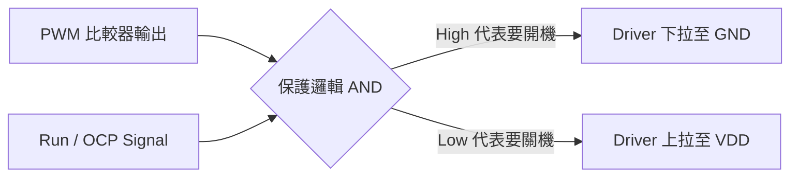

# [SIMPLIS 建模實戰 06] 最後的拼圖：PWM 邏輯與 P-Channel 驅動器

在之前的章節中，我們已經打造好了心跳（振盪器）、大腦（誤差放大器）以及盔甲（保護機制）。現在，我們要建立這顆 IC 的「手臂」—— **Gate Driver (閘極驅動器)**，並透過 **PWM 比較器** 將大腦的指令轉換為功率切換訊號。

---

## ⚡ PWM 比較器：從類比到數位的轉換

PWM 比較器的任務很單純：比較誤差放大器的輸出 (`COMP`) 與振盪器產生的鋸齒波 (`Ramp`)。

- 當 $V_{Ramp} < V_{COMP}$ 時，PWM 訊號為 **Active** (代表應該導通功率管)。
- 當 $V_{Ramp} > V_{COMP}$ 時，PWM 訊號為 **Inactive** (代表應該關閉功率管)。

> **💡 資深工程師的叮嚀：**
> 在 SIMPLIS 建模時，務必在比較器輸出後加入我們在 Part 5 提到的 **OCP 與 SS 致能邏輯**。如果 OCP 觸發或系統尚未進入致能狀態，不論 COMP 的電位多高，PWM 都必須被強制關閉。

---

## 🏎️ P-Channel 驅動器的「負邏輯」

這是 TPS40200 最具特色的地方。絕大多數的 Buck 控制器驅動 N-MOSFET，需要透過 Boot-strap 提升電位；但 TPS40200 驅動 **P-MOSFET**。

對於 P-MOSFET 來說：
- **開啟 (Turn ON)**：$V_{GS}$ 需為負值。意即 $GATE$ 腳位必須被**拉低 (Pull-down)** 到地。
- **關閉 (Turn OFF)**：$V_{GS}$ 需為 0V。意即 $GATE$ 腳位必須被**拉高 (Pull-up)** 到 $V_{DD}$。

因此，在子電路的最終輸出級，我們的邏輯是「反向」的：當 PWM 比較器輸出為 High 時，GATE 腳位反而要被拉到 Low。

---

## 🛠️ SIMPLIS 實作：建立具備阻抗的驅動級

雖然我們是在做 Behavior Model，但如果不考慮驅動器的輸出阻抗，切換波形會完美得太不真實（零上升時間），這會導致你無法觀測到 MOSFET 的切換損耗與閘極震盪。

在 SIMPLIS 中，我推薦使用兩個 **電壓受控開關 (VCSW)** 搭配 **電阻** 來模擬輸出級：

1.  **上拉路徑 (Turn-OFF)**：
    *   放置一個電阻 $R_{sink} \approx 10\Omega$。
    *   串聯一個開關接往 $V_{DD}$。
2.  **下拉路徑 (Turn-ON)**：
    *   放置一個電阻 $R_{source} \approx 2\Omega$。
    *   串聯一個開關接往 $GND$。
3.  **邏輯互鎖**：
    在建模時，我們可以使用一個反向器 (Inverter) 確保兩個開關不會同時導通。

---

## 📦 模組總結：Top-Level 的大團圓

到這一步，你的 `TPS40200_Behavior_Model` 子電路應該已經具備了完整的生命力。它包含了：
- **UVLO 模塊** (Part 2)
- **Oscillator 模塊** (Part 3)
- **EA & VREF 模塊** (Part 4)
- **SS & OCP 邏輯** (Part 5)
- **PWM & Driver 輸出** (Part 6)

現在，你可以將這個電路全選，並使用 **"Create Subcircuit"** 功能，為它畫上一個標準的 8-pin 封裝圖示。這顆「數位分身」已經準備好接受真實電路的考驗了。

---

## 📈 接下來的挑戰

萬事俱備，只欠東風。
在下一篇 **[Part 07]**（也是本系列的最終章），我們將把這顆親手打造的 IC 放入一個完整的 Buck Converter 電路中。我們將使用 **POP 分析** 與 **AC 迴路分析**，驗證其穩態與動態特性。

這將是驗證我們過去六章心血的「終極試煉」！
